# rylan-unifi-case-study  
**Production-Grade UniFi Network + AI-Augmented Helpdesk – v5.1 Eternal Multi-Role**  
*December 2025 – `feat/rylan-dc-eternal-multirole-v5.1` → Ready to merge into `main`*  

[](https://github.com/T-Rylander/rylan-unifi-case-study/actions?query=branch%3Afeat/rylan-dc-eternal-multirole-v5.1)

## 🏗️ Architecture Overview (v5.1)

```mermaid
graph TB
    subgraph Internet
        WAN[Cable Modem]
    end
    subgraph "Management VLAN 1"
        USG[USG-3P<br>10.0.1.1<br>UniFi 8.5.93]
        Switch[UniFi Switch Lite 8 PoE]
    end
    subgraph "Servers VLAN 10"
        ADDS[Samba AD/DC + DNS + NFS<br>rylan-dc<br>10.0.10.10<br>enp4s0]
        AIWork[AI Workstation<br>10.0.10.60<br>Ollama • Qdrant • Triage]
    end
    subgraph "Trusted Devices VLAN 30"
        RPi[Raspberry Pi 5 8GB<br>osTicket + MariaDB<br>10.0.30.40]
        PXE[Lightweight PXE/proxyDHCP<br>rylan-dc<br>10.0.30.10<br>enp4s0 sub-if]
    end
    subgraph "VoIP VLAN 40"
        Phone[Grandstream Phones<br>EF/DSCP 46]
    end
    subgraph "Guest/IoT VLAN 90"
        Guest[Guests + Smart Devices<br>Internet-Only]
    end

    WAN --> USG
    USG --> Switch
    Switch --> ADDS
    Switch --> AIWork
    Switch --> RPi
    Switch --> PXE
    Switch --> Phone
    Switch --> Guest

    AIWork -.HTTP API.-> RPi
    RPi -.Webhook.-> AIWork
    ADDS -.AD/DNS/NFS.-> AIWork
    ADDS -.AD/DNS.-> RPi
    PXE -.PXE Boot.-> RPi
```



Full source: `docs/architecture-v5.mmd`

## 🎯 v5.1 What’s New – Eternal rylan-dc (No Extra Hardware)

| Role                            | IP            | VLAN | Interface       | Notes                                  |
|---------------------------------|---------------|------|-----------------|----------------------------------------|
| Samba AD/DC + DNS + NFS + Influx| 10.0.10.10    | 10   | enp4s0          | Primary interface                      |
| Lightweight PXE / proxyDHCP     | **10.0.30.10**| 30   | enp4s0 (sub-if) | dnsmasq, iPXE chainload, VLAN 30 only  |
| UniFi Controller (legacy)       | 10.0.1.20     | 1    | macvlan         | Inform on 8081                         |

→ Laptops on VLAN 30 now PXE boot → auto-join domain. Zero VLAN changes. One extra allow rule (#8). Policy table still **8 rules total** → USG-3P hardware offload preserved forever.

## 🔒 Zero-Trust Status (Locked at 8 Rules)

- Network Isolation = ON  
- Policy Table = 8 rules (<15 → full hardware acceleration)  
- Latest file: `02-declarative-config/policy-table-rylan-v5.json` (JSON source of truth)

## 📊 Production VLAN Table (December 2025)

| VLAN | Name            | Subnet         | Gateway      | Purpose                     |
|------|-----------------|----------------|--------------|-----------------------------|
| 1    | Management      | 10.0.1.0/27    | 10.0.1.1     | UniFi devices + controller  |
| 10   | servers         | 10.0.10.0/26   | 10.0.10.1    | Infrastructure              |
| 30   | trusted-devices | 10.0.30.0/24   | 10.0.30.1    | Workstations + osTicket + PXE |
| 40   | voip            | 10.0.40.0/27   | 10.0.40.1    | VoIP only                   |
| 90   | guest-iot       | 10.0.90.0/25   | 10.0.90.1    | Guest + IoT                 |

## 🚀 Quick Deploy (v5.1)

```bash
git clone https://github.com/T-Rylander/rylan-unifi-case-study.git
cd rylan-unifi-case-study
git checkout feat/rylan-dc-eternal-multirole-v5.1

python -m venv .venv && source .venv/bin/activate
pip install -e .

# Always dry-run first
python 02-declarative-config/apply.py --dry-run

# Apply (will prompt)
python 02-declarative-config/apply.py --apply
```

### Enable Eternal PXE on rylan-dc (one-time)

```bash
# Sub-interface (enp4s0)
sudo cp bootstrap/netplan-rylan-dc.yaml /etc/netplan/99-rylan-dc.yaml
sudo netplan apply

# Lightweight PXE service
sudo cp bootstrap/pxe-light-dnsmasq.conf /etc/dnsmasq.d/
sudo cp bootstrap/pxe-light.service /etc/systemd/system/
sudo systemctl daemon-reload
sudo systemctl enable --now pxe-light.service
```

## 🤖 AI Triage Engine (10.0.10.60)

```bash
cd 03-ai-helpdesk/triage-engine
docker build -t triage:v5.1 .
docker run -d --name triage -p 8000:8000 \
  -e OLLAMA_HOST=http://localhost:11434 \
  -e OSTICKET_URL=http://10.0.30.40 \
  -e AUTO_CLOSE_THRESHOLD=0.93 \
  triage:v5.1
```

## 🔧 Validation Commands

```bash
# Full isolation + PXE check
bash 03-validation-ops/validate-isolation.sh | grep -E "(PXE|10.0.30.10)"

# Verify both IPs on rylan-dc
ip addr show enp4s0

# AI → osTicket connectivity
curl -H "X-API-Key: $OSTICKET_KEY" http://10.0.30.40/api/tickets
```

## 📌 Current Status – December 2025

| Component                  | Status | Notes                                      |
|----------------------------|--------|--------------------------------------------|
| Zero-Trust Policy Table    | 8/15 rules | Eternal headroom                           |
| rylan-dc Eternal Multi-Role| Ready  | PXE on VLAN 30, no extra hardware         |
| AI Ticket Triage           | 93%+ auto-close | Presidio → Ollama pipeline intact          |
| CI/CD                      | 100% green | Rule counter, dry-run, Docker smoke        |
| IaC Coverage               | 90%    | Policy/QoS still manual GUI (next target)  |

Branch `feat/rylan-dc-eternal-multirole-v5.1` is **merge-ready**.  
CI green. No offload risk. Junior-at-3-AM deployable.

Merge it → v5.1 ships → eternal infrastructure achieved. 🟢

**Maintained by**: hellodeolu-era systems architecture team  
**License**: MIT
